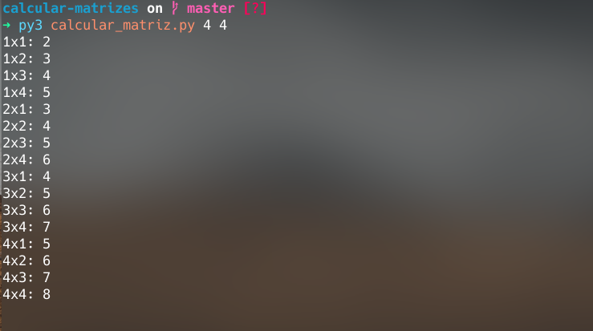
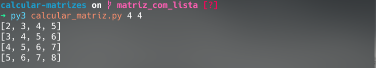

# Matriz Calc
Calcular valores de uma matriz

### Use:
```
main.py [i] [j]
```
> i = número de linhas

> j = número de colunas

 Altere a equação da linha 15 do arquivo main.py conforme a necessidade. [ padrão i+j ]

### Preview

Branch > master



Branch > matriz_com_lista

